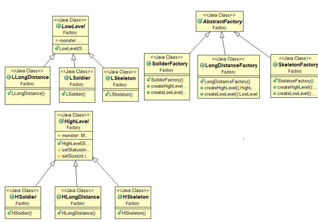
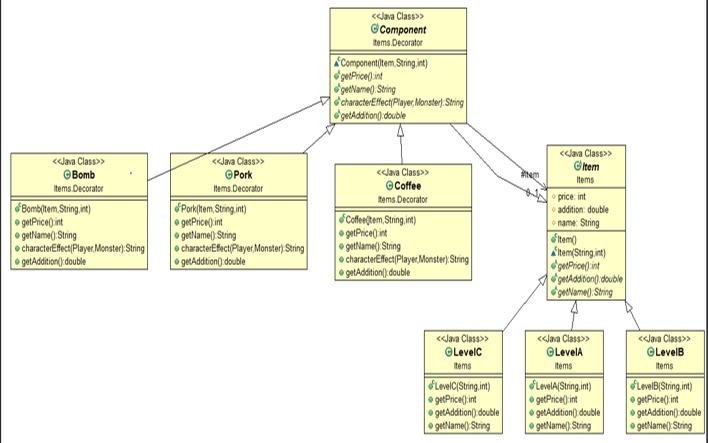
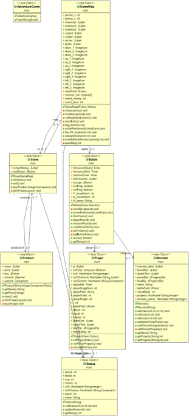
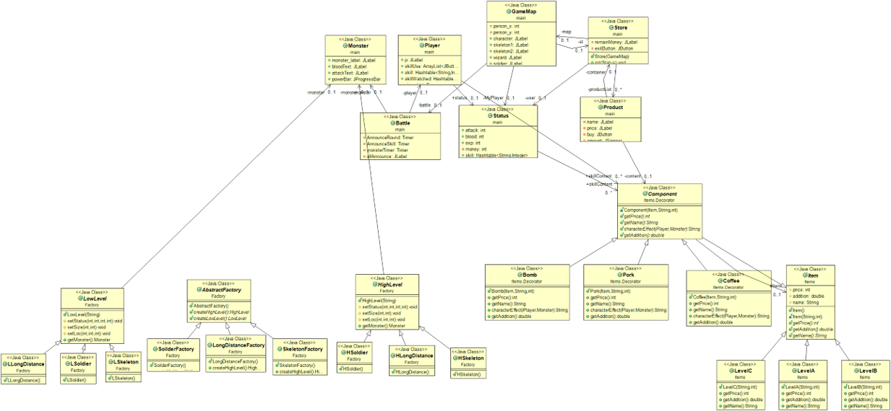

# Design Pattern
此repo用來紀錄重構遊戲的project
# 遊戲名稱: Beat Monster 
大二的時候跟組員為了修課用JAVA寫的小型冒險遊戲

但是因為deadline問題導致code很亂

剛好藉由大三 **軟體設計** 這門課進行重構
## 主要重構內容
* Variable 命名與無用的註解
* Function 內容冗長
* Class 大太切成更小 Component
* Function Formatting
* Variable public/private, local/global 位置問題
* Private variable 暴露問題
* 重複性質 class，無用繼承關係
* **Abstract Factory Pattern**
* **Decorator Pattern**

## 主要Design Pattern重構
### Abstract Factory - Monster 設計問題
* 利用 Abstract Factory 來實現
* GameMap 產生怪物的時候只需要告訴我要生成的怪物
* 交給專門生成那個怪物的 Factory 來做
* 設定怪物的值交給 Factory 所負責

### Decorator Pattern - 角色道具問題
* 利用 Decorator Pattern 實現道具等級的劃分
* 道具為我的 component
* 底下的 LevelA~C 為道具的 Decorator

# project before refactor

# project after refactor

